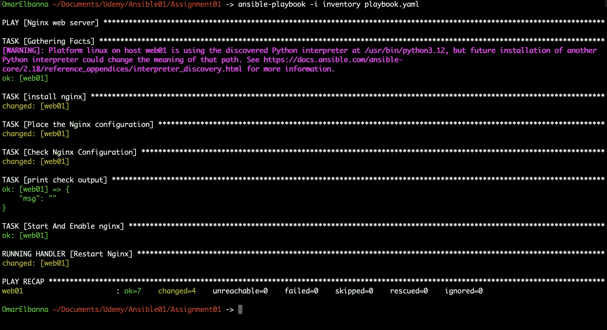

# Assignment 1: Nginx Setup with Multipass and Ansible

## Overview

In this task, I created a new virtual machine using **Multipass**, configured it, and deployed an Nginx web server using **Ansible**. The goal was to restrict access to the Nginx web server based on specific IP addresses, which I passed as a list variable in the Ansible playbook.

## 🛠️ **Technologies Used**

[](#)  
[](#)  
[](#)

##  

## Steps I Followed:

### 1. **Created a New Machine Using Multipass:**
I used **Multipass** to create a new virtual machine. This VM hosts the Nginx web server.

- **Command to create a new instance:**
  
```bash
multipass launch --name web01 --cloud-init ansible_multipath.yaml
```

This created a new instance named `web01` with the specified resources.

### 2. **Created a inventory File:**
I created an **Ansible hosts file** to include the IP address of the newly created machine. This allowed Ansible to target the new VM.

- **hosts file:**

```ini
ansiblemain ansible_host=192.168.66.6
web01 ansible_host=192.168.66.7
[my_hosts]
web01
[my_hosts:vars]
ansible_connect=ssh
ansible_user=ansibleadmin
ansible_private_key_file=~/.ssh/id_rsa
```

### 3. **Created a Playbook for Nginx Installation and Configuration:**
I created an Ansible playbook to automate the installation of Nginx and configure it to restrict access based on IP addresses.

- **playbook (`playbook.yml`):**

```yaml
---
- name: Nginx web server
  hosts: my_hosts
  vars: 
    server_name: mynginx.local
    html_location: /var/www/html
    allowed_ips:
      - 192.168.1.50
      - 192.168.1.60
      - 192.168.1.70
  become: true
  tasks:
    - name: install nginx
      ansible.builtin.apt:
        name: nginx
        state: present
        update_cache: yes
    - name: Place the Nginx configuration
      ansible.builtin.template:
        src: nginx.conf.j2
        dest: /etc/nginx/sites-available/default
        mode: '0644'
        owner: root
        group: root
      notify: Restart Nginx
    - name: Check Nginx Configuration
      ansible.builtin.command:
        cmd: nginx -t
      register: check_output
    - name: print check output
      ansible.builtin.debug:
        msg: "{{ check_output.stdout }}"
    - name: Start And Enable nginx
      ansible.builtin.service:
        name: nginx
        state: started
        enabled: true
  handlers:
    - name: Restart Nginx
      ansible.builtin.service:
        name: nginx
        state: restarted
```

### 4. **Created a Jinja Template for the Nginx Configuration:**
I created a **Jinja template** (`nginx.conf.j2`) for the Nginx configuration file that dynamically inserts the allowed IP addresses.

- **`nginx.conf.j2` template:**

```jinja
server {
    listen 80;
    server_name {{ server_name }};
    
    location / {
        root {{ html_location }};
        index index.html index.htm;
 
        # Deny access by default
        deny all;
 
        # Allow access only from specified IPs
        
        allow {{ ip }};
        
    }
}
```

This Jinja template renders the Nginx configuration file with the list of allowed IP addresses dynamically inserted.

### 5. **Defined Handlers for Nginx Reload:**
The playbook includes a **handler** to reload Nginx if the configuration file changes. This was done using the `notify` directive in the tasks section.

### 6. **Run the Playbook:**
After setting up the hosts file, playbook, and template, I ran the playbook to apply the changes to the target machine.

- **Command to run the playbook:**

```bash
ansible-playbook -i inventory playbook.yaml
```

## 

## Requirements:

- **Multipass** was installed and configured to create virtual machines.
- **Ansible** was installed and configured to manage remote machines.
- **The target machine** had SSH access with the appropriate credentials.
- **The Ansible user** had privilege escalation (using `become: true`) to perform necessary tasks like installing software and modifying system files.

## Conclusion:
By the end of this task, I successfully created a virtual machine using **Multipass**, configured it using **Ansible**, and deployed a properly secured **Nginx web server** that restricts access based on a list of allowed IP addresses.
