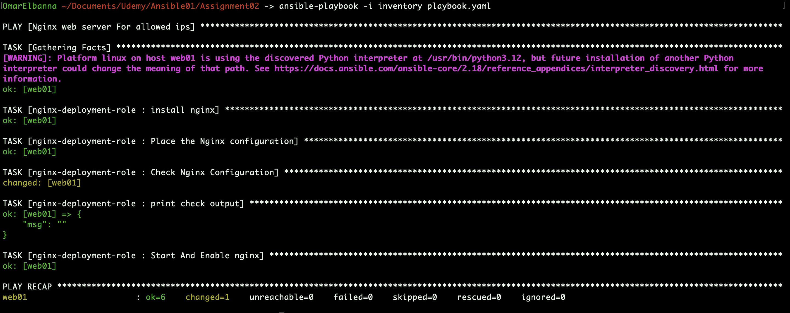

### Assignment 2: Nginx Setup with Ansible Roles

## Overview

In this task, I implemented the same Nginx setup as **Assignment 1**, but this time I leveraged **Ansible roles** to automate the process. By creating a reusable role, I was able to streamline the configuration of the Nginx web server and apply it consistently across multiple hosts.

## 🛠️ **Technologies Used**

[](#)  
[](#)  
[](#)

## 

## Steps I Followed:


### 1. **Created an Ansible Role for Nginx Setup:**
Instead of directly configuring Nginx within the playbook, I created an **Ansible role** to handle the installation, configuration, and startup of Nginx.
```bash
ansible-galaxy role init roles/nginx-deployment-role
```

- **Directory Structure for the Role:**

```bash
roles/nginx-deployment-role/
├── tasks/
│   └── main.yml
├── templates/
│   └── nginx.conf.j2
├── defaults/
│   └── main.yml
└── handlers/
    └── main.yml
```

### 3. **Role Files:**
#### **vars/main.yml** (Role Default Variables):
```yaml
---
server_name: mynginx.local
html_location: /var/www/html
allowed_ips:
  - 192.168.1.50
  - 192.168.1.60
  - 192.168.1.70
```

#### **tasks/main.yml** (Role Tasks):
```yaml
---
- name: Install Nginx
  ansible.builtin.apt:
    name: nginx
    state: present
    update_cache: yes

- name: Place the Nginx configuration
  ansible.builtin.template:
    src: nginx.conf.j2
    dest: /etc/nginx/sites-available/default
    mode: '0644'
    owner: root
    group: root
  notify: Restart Nginx

- name: Check Nginx Configuration
  ansible.builtin.command:
    cmd: nginx -t
  register: check_output

- name: Print check output
  ansible.builtin.debug:
    msg: "{{ check_output.stdout }}"

- name: Start and Enable Nginx
  ansible.builtin.service:
    name: nginx
    state: started
    enabled: true
```

#### **templates/nginx.conf.j2** (Jinja2 Template):
```jinja
server {
    listen 80;
    server_name {{ server_name }};
    
    location / {
        root {{ html_location }};
        index index.html index.htm;
 
        # Deny access by default
        deny all;
 
        # Allow access only from specified IPs
        
        allow {{ ip }};
        
    }
}
```

#### **handlers/main.yml** (Handlers for Restarting Nginx):
```yaml
---
- name: Restart Nginx
  ansible.builtin.service:
    name: nginx
    state: restarted
```

### 4. **Update the Playbook to Use the Role:**
Instead of defining tasks directly in the playbook, I included the newly created Nginx role in the playbook to apply the configurations.

- **Playbook (`playbook.yml`):**

```yaml
---
- name: Nginx web server For allowed ips
  hosts: my_hosts
  become: true
  roles:
    - nginx-deployment-role
```

### 5. **Run the Playbook:**
After setting up the role, inventory, and playbook, I ran the playbook to apply the changes to the target machine.

- **Command to run the playbook:**

```bash
ansible-playbook -i inventory playbook.yml
```

## 

## Requirements:

- **Multipass** was installed and configured to create virtual machines.
- **Ansible** was installed and configured to manage remote machines.
- **The target machine** had SSH access with the appropriate credentials.
- **The Ansible user** had privilege escalation (using `become: true`) to perform necessary tasks like installing software and modifying system files.

## Conclusion:
By the end of this task, I successfully re-implemented the **Nginx web server setup** using **Ansible roles**. This approach made the configuration more modular, reusable, and maintainable. The playbook applies the Nginx configuration consistently across multiple hosts, and the role can be reused in other environments or tasks as needed.